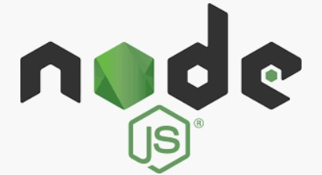

<!-- $size: 16:9 -->

정보기술공학
===

## 2019학년도 2학기 학사

### 담당: 김희숙(jasmin11@hanmail.net)

---
강의소개(01)
===

- Markdown 문법 사용한 문서 작성
- github 
- 웹 페이지 레이아웃
- Node.js
	- SQL: MySQL
	- NoSQL: MongoDB

---
강의소개(02)
===

## 참고 교재
- "Do it! Node.js 프로그래밍, 전면개정판", 정재곤, 이지스퍼블리싱, 2017.03
- "Node.js 교과서", 조현영, 길벗, 2018.08


## 성적 평가
- 출석(20%) + 중간(25%) + 기말(35%) + 과제 및 수업실습(20%)
- 상대평가 (학과 규정에 의거 성적 산출)

---
강의소개(03)
===
## 프로그램
- Node.js(https://nodejs.org/ko/download/)
- Mongodb(https://www.mongodb.com/)
- MySQL 5.7(https://www.mysql.com/products/community/)
- 에디터
	- Brackets(http://brackets.io/)
	- Visual Studio code(https://code.visualstudio.com/)
---
# Markdown 문법

1. 구조적인 글쓰기가 가능하다
2. 구조적인 글을 빠르게 작성할 수 있고 나중에 알기도 쉽다.
---
# git (01)

- git: 버전 관리 시스템(분산형 버전 관리 시스템)
- github: git 을 저장하는 원격저장소

* README.md: 저장소에 대한 설명
* .gitignore: Track 하지 않을 파일 목록을 적어두는 곳
* license: 소프트웨어 라이센스
---
# git (02) 실습

## A. Github: 원격저장소

1. Github 로그인(회원가입)

https://github.com/ 

```
아이디 있는 경우 sign in/ 아이디 없는 경우 sign up

username:
email:
password:
```
2) 새 저장소 생성: [New Repository]
Create repository
	- TechEN192_본인이름 (예: TechEN192_KimHeeSook)
3) 마크다운 문서 연습
	- 01markdown_본인이름.md

---
## B. Github Pages

1. 로그인: sign in
```
왼쪽 초록색: repository 또는 New repository 
오른쪽 상단 + New repository
```
2. repository
repository 이름: test
```
public
private
initialize 체크
MIT License

create
오른쪽 settings
```
---
3. Github pages
```
none -> master branch -> save

test -> 본인아이디.github.io  -> rename
```
5. repository 선택
```
 세번째 버튼 : upload files

   윈도우즈탐색기: index.html
```
6. 웹브라우저
```
http://본인아이디.github.io/
```
